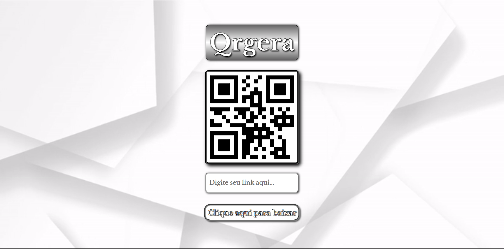

# Qrgera - Gerador de QrCode

Deploy: https://qrcode-leandrolsantos.vercel.app/

## Sobre

Este projeto tem como intuito fazer parte de um acervo de ferramentas que pretendo adicionar ao meu portifólio. É um gerador de QrCode com o nome de "Qrgera", a intenção é que seja utilizada por outras pessoas para facilitar na divulgação de links em geral.

### Objetivo

O foco é praticar a funcionabilidades do React. Este é meu segundo projeto usando esta biblioteca de JavaScript e pretendo continuar desenvolvendo com ela.

### Desafio

Sair da zona de conforto e trabalhar com React, pois ainda tenho pouca prática com este acervo de JS. Gosto da comodidade que ele traz combinando JavaScript com HTML e CSS.

### Conclusão

Conclui este projeto com muita satisfação do resultado e certeza do meu avanço com o React. É muito interessante trabalhar com essa biblioteca, irei me dedicar ainda mais a esta ferramenta e em breve publicarei mais projetos.

### Ferramentas Utilizadas

- HTML
- CSS
- JavaScript
- React